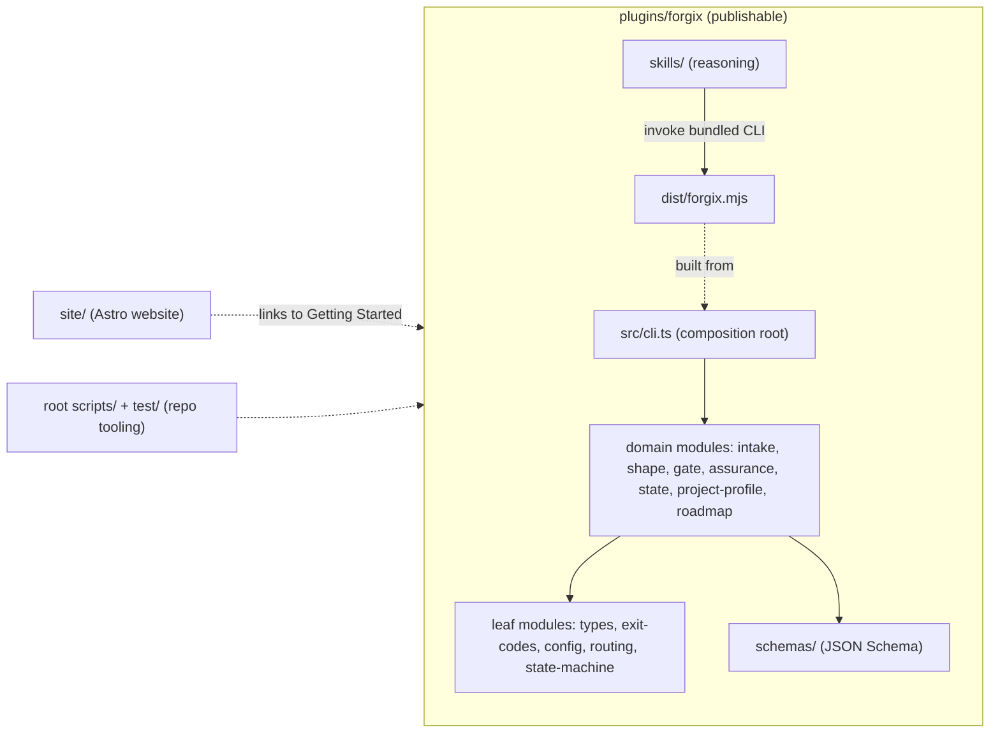

```mermaid
flowchart LR
  subgraph plugin["plugins/forgix (publishable)"]
    skills["skills/ (reasoning)"] -->|"invoke bundled CLI"| dist["dist/forgix.mjs"]
    dist -.->|"built from"| cli["src/cli.ts (composition root)"]
    cli --> domain["domain modules: intake, shape, gate, assurance, state, project-profile, roadmap"]
    domain --> core["leaf modules: types, exit-codes, config, routing, state-machine"]
    domain --> schemas["schemas/ (JSON Schema)"]
  end
  site["site/ (Astro website)"] -.->|"links to Getting Started"| plugin
  tooling["root scripts/ + test/ (repo tooling)"] -.-> plugin
```
