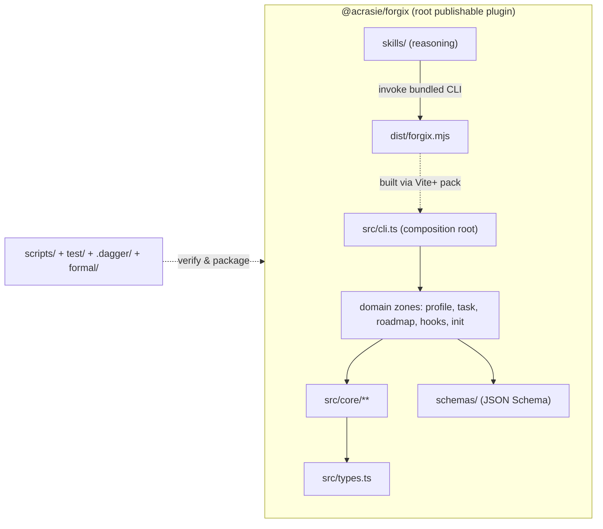

```mermaid
flowchart LR
  subgraph plugin["@acrasie/forgix (root publishable plugin)"]
    skills["skills/ (reasoning)"] -->|"invoke bundled CLI"| dist["dist/forgix.mjs"]
    dist -.->|"built via Vite+ pack"| cli["src/cli.ts (composition root)"]
    cli --> domains["domain zones: profile, task, roadmap, hooks, init"]
    domains --> core["src/core/**"]
    core --> types["src/types.ts"]
    domains --> schemas["schemas/ (JSON Schema)"]
  end
  tooling["scripts/ + test/ + .dagger/ + formal/"] -.->|"verify & package"| plugin
```
